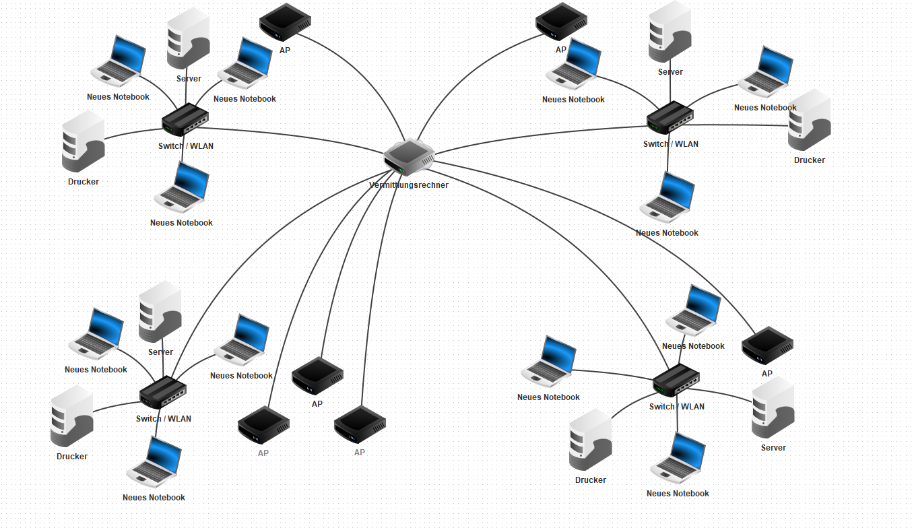

# Firma yihaaaaa.biz

## Netzwerkmodell mit Fillius

## Subnet-Unterteilung
Geschäftsleitung/Finanzen/Rechtsabteilung für 7 Mitarbeiter 14 Geräte können verbunden sein Ip bereich 172.16.1.1 – 172.16.1.14
Marketing/Verkauf - 8 Mitarbeiter und 1 Lernende 14 Geräte Ip bereich 172.16.1.17- 172.16.1.30
Produktion/Vertrieb - 18 Mitarbeiter und 4 Lernende 30 Geräte haben platz Ip bereich 172.16.1.33 - 172.16.1.62
IT-Abteilung/Operation - 7 Mitarbeiter und 2 Lernende 14 Geräte 172.16.1.65 - 172.16.1.78

## Stückliste
4x Netgear GS324P-100EUS (236 CHF pro Stück/ am selben Tag geliefert)
6x Netgear AccessPoint (643 CHF 5er Bundle + 139 CHF / am selben Tag geliefert)
1x Ubiquiti EdgeRouter X SFP (68.90 CHF / am selben Tag geliefert)

## Namenskonvention
### Namenskonvention Für Geräte:
Switch: SW
Router: RT
Access Point: AP
Server: SRV
### Abteilungen
Geschäftsleitung/Finanzen/Rechtsabteilung: GLFR
Marketing/Verkauf: MKT
Produktion/Vertrieb: PROD
IT Abteilung/Operations: ITOP
### Namensvergebung:
[Gerät-Abteilung]
Zum Beispiel: SW-ITOP (Switch, It Abteilung/Operations)

## Testprotokoll
*[Testprotokkoll](image.png)

## Betriebshandbuch
### Planung
Um ein Projekt zu beginnen, ist die Planung essenziell. Wir begannen mit dem chen der Materialien. Wir schauten uns an, welche Geräte wir zur Verfügung haben, und welche H wir sonst noch brauchen. Diese fragten wir an.
Die Planung wurde mit einem Netzwerkplan in Filius verarbeitet.
### Einrichtung
Wir begannen mit dem Connecten der Switches. Als erstes hatten wir diese geresetet. Diese wurden mit verschiedenen Ethernet-Kabel verbunden. Wir probierten, einen 4ten PC aufzusetzen, welches aufgrund verschiedener Faktoren nicht möglich war.
### Auftrag
Zunächst recherchierten wir, wie wir den DHCP-Server einrichten kann. Als erstes hatten wir den Edge Router geresetet. Anschliessend konfigurierten wir ihn im Browser. Wir nutzten die Range von privaten IPs, in unserem Fall 172er IPs. Auch den DNS richteten wir ein. Anschliessend testeten wir die Verbindung mit dem gegenseitigen Pingen. Dies erfolgte ohne Probleme. Im Anschluss konfigurierten wir auch noch den Access Point. Auch diese erfolgte ohne weitere Probleme. 
Fazit & Zusammenfassung
Für das Einrichten des DHCP-Servers sollten nur private IP-Adressen, also bspw. 192er oder 172er Adressen verwendet werden. Dies, da alle anderen abgehört werden können. Das Bestimmen des CIDR-Suffixes in einem Subnetz ist auch wichtig, damit alle benötigten IPs Platz haben. Das Netzwerk wird deshalb auch effizienter genutzt, da dann weniger vorige IPs sind. 
*[Beispiel]](<image (1).png>)
